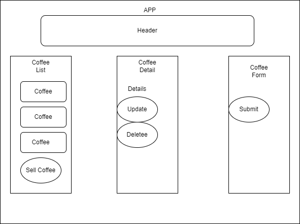

# Cafe Inventory Tracker#

#### _My first React project at Epicodus. It lets me practice passing props in a component tree while managine state slices. ._

#### By _**Ryan Rendon**_

## Technologies Used

* _Node Package Manager_
* _Javascript_
* _HTML_
* _React_
* _create-react-app_

## Description

_In this project you can add different kinds of coffee or inventory at a local cafe to see many lbs of coffee beans you have and easy button to minus 1lb when you sell a cup_

## Setup/Installation Requirements

* You can visit my github Rendo4 or you can copy this link to my repository _
* _open your terminal_
* _use the command "cd desktop"_
* _use the command "git clone _
* _It should now be on your desktop!_ 
* _In your terminal cd desktop/coffee-shop_
* _use the command "npm install_
* _use the command "npm run start"
## Known Bugs

* _If you encounter a complie error open the package.json folder and save the folder. It will recomple correctly_

## License

Copyright 2022 Ryan Rendon

Licensed under the Apache License, Version 2.0 (the "License");
you may not use this file except in compliance with the License.
You may obtain a copy of the License at

    http://www.apache.org/licenses/LICENSE-2.0

Unless required by applicable law or agreed to in writing, software
distributed under the License is distributed on an "AS IS" BASIS,
WITHOUT WARRANTIES OR CONDITIONS OF ANY KIND, either express or implied.
See the License for the specific language governing permissions and
limitations under the License.

## Contact Information
_{Rendon.S.Ryan@gmail.com}_